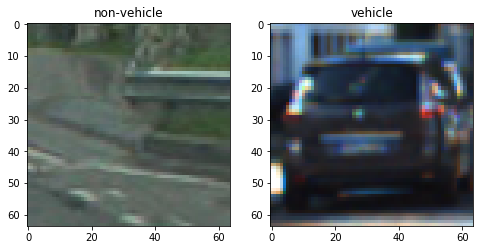
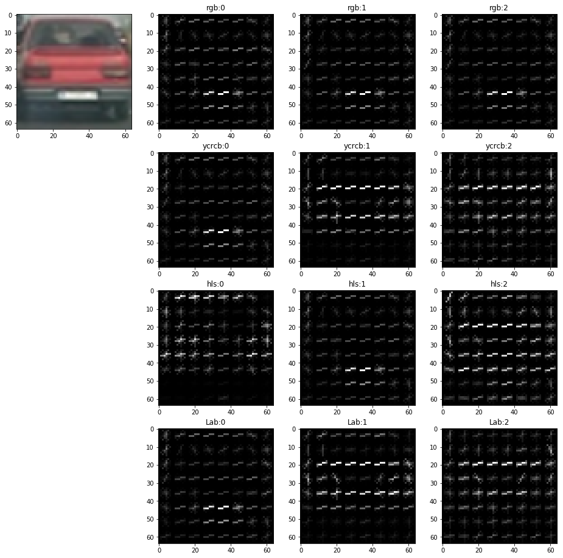
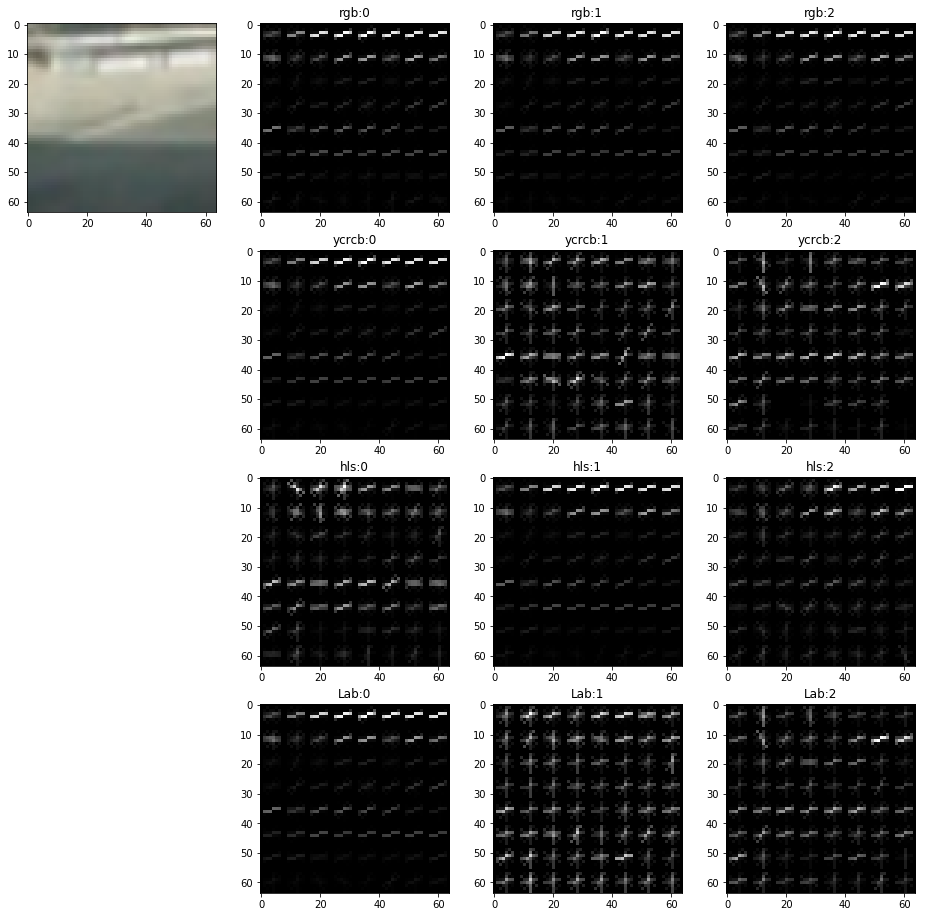
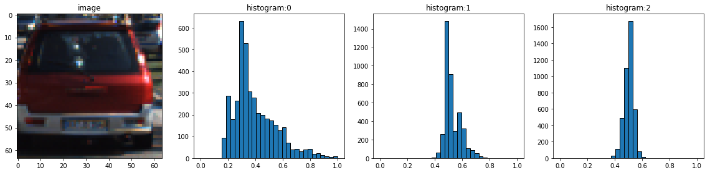
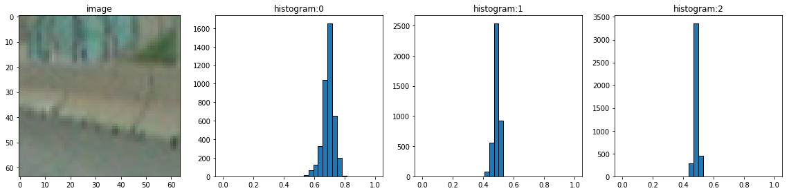
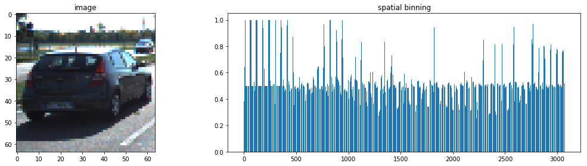
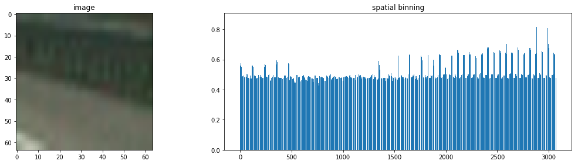
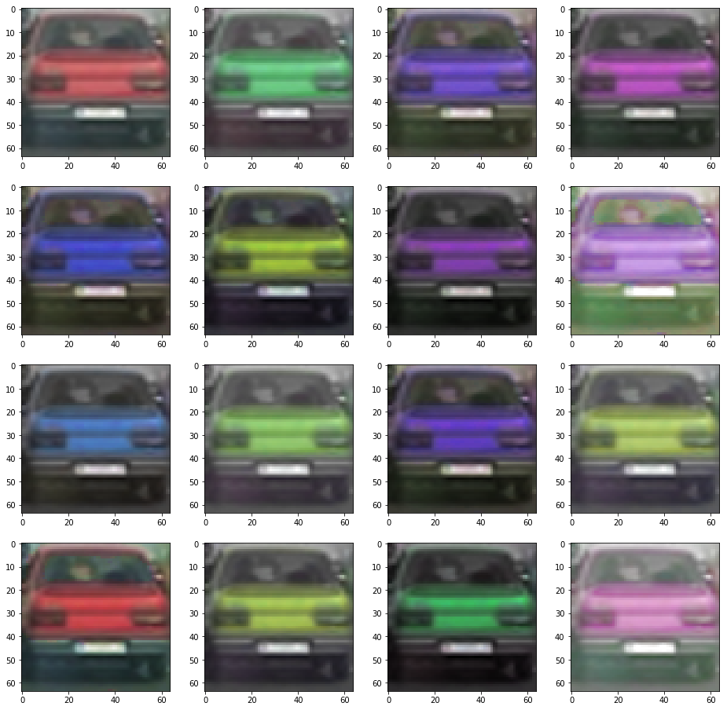

# Vehicle Detection Project
[](http://www.udacity.com/drive)

The goal of this project, your goal is to write a software pipeline to detect
vehicles in a video.

Main steps of the algorithm:
* Features extraction on a labeled training set of images
* Features normalization
* Training classifier
* Using sliding-window in order to detect vehicles on video stream
* Analyze bounding boxes in order to achieve reasonable tracking quality

---

## Usage
### Model Training
```sh
python train.py -p positive -n negative -s 0.2 -C 0.1 1 10 -- model.p
```

* `p` - directory with positive examples (all images will be used)
* `n` - directory with negative examples (all images will be used)
* `s` - fraction of images to be used for test set, default _0.2_
* `C` - list SVM `C` parameter values to try, default _[1]_
* `model.p` - model name

### Processing Video
```sh
python video.py -o output.mp4 -m model.p -b 10 -e 18 input.mp4
```

* `o` - output video name
* `m` - model to use
* `b` - second to start from, optional
* `e` - second to end with, optional
* `input.mp4` - input video name

## Structure
| Name             | Function |
|------------------|----------|
| `averager.py`    | _simple_ averager |
| `detector.py`    | detection routines |
| `features.py`    | routines for ferature extraction |
| `image.py`       | image processing utilities |
| `model.py`       | model related routines (eg. store, load, predict) |
| `pipeline.py`    | train set processing pipeline |
| `roi.py`         | routines to calculate region of interest |
| `test_images.py` | utilities for easy access to test images |
| `trackable.py`   | trackable object, simple match criteria |
| `tracker.py`     | _simple_ object tracker |
| `train.py`       | entry point for model training |
| `video.py`       | entry point for video processing |
| `window.py`      | sliding window technique implementation |

## Classifier
### Feature Extraction
In the project I used the following features in order to detect vehicles.
1. Histogram of Oriented Gradients (HOG) - cell=_8_, block=_3_, orientations=_9_
2. Color histograms - bins=_32_
3. Binned color feature - size=_32x32_

I started by reading in all the `vehicle` and `non-vehicle` images (`pipeline.read`).
Here is an example of one of each of the `vehicle` and `non-vehicle` classes:



#### Histogram of Oriented Gradients (HOG)

The code for this step is contained in `features.py:hog()`.

I explored different color spaces and different `skimage.hog()` parameters
(`orientations`, `pixels_per_cell`, and `cells_per_block`).  
I grabbed random images from each of the two classes and displayed them to get
a feel for what the `skimage.hog()` output looks like. Here is an example using
the different color space and HOG parameters of `orientations=9`,
`pixels_per_cell=(8, 8)` and `cells_per_block=(3, 3)`:





I tried various combinations of parameters and color spaces (images above) and
decided to use:
* `orientations=9`,
* `pixels_per_cell=(8, 8)`
* `cells_per_block=(3, 3)`

Bigger values for `orientations` and `cells_per_block`, smaller value
for `pixels_per_cell` increases size of the feature which leads to model
overfitting. Opposite change decreases size of the feature but I noticed
accuracy decrease as well. Values above provides good trade-off between
feature size and final accuracy.

#### Color Histogram

The code for this step is contained in `features.py:hist()`.

Example of histograms for both `vehicle` and `non-vehicle` classes:





After several experiments I stopped on `bins` value of _32_.

#### Spatial Binning

The code for this step is contained in `features.py:bin()`.

Example of histograms for both `vehicle` and `non-vehicle` classes:





After several experiments I stopped on `size` value of _32x32_.

#### Feature Vector

The feature vector for the project is a combinations of all three parts
described above based on _YCrCb_ color space.

Length of the feature vector _11916_ of which
* _3 * 32_ = _96_ - Histogram
* _3072_ - Spatial Binning
* _3 * 2916_ = _8748_ - HOG

### Training
#### Model
The code for the model is contained in `model.py`.

I choose `sklearn.svm.LinearSVC` as the primary classifier for the project.
Main reasons for the choice - relatively fast training speed, good accuracy.
The worst thing about classifier (actually all `sklearn` classifiers suffers
from it) - there is no parallelism during training process, so most cpu
power of modern computers remain un-utilized.

I used `sklearn.model_selection.GridSearchCV` in order to find optimal model
parameters during training. One of advantage of `GridSearchCV` it can train
several models in parallel (`n_jobs` parameter).

My choice was to search optimal `C` parameter in range [0.04, 1, 25]

#### Data
##### Normalization
In the project I use `sklearn.preprocessing.StandardScaler` to normalize data.
The code is in:
* `model.py:train()` for training
* `model.py:predict()` for prediction

##### Augmentation
The original Udacity data for [vehicle](https://s3.amazonaws.com/udacity-sdc/Vehicle_Tracking/vehicles.zip)
and [non-vehicle](https://s3.amazonaws.com/udacity-sdc/Vehicle_Tracking/non-vehicles.zip)
data sets contain _8792_ and _8968_ respectively. First experiments shown the
model tend to overfit. In order to fight overfitting (apart from tuning
  `C` parameter) I used the following data augmentation techniques:

* Image flipping across x-axis (`image.py:flip()`). The transformation feels
  reasonable and effectively doubles number of examples.  
* Random `luminance`(_[-30, 30]_) and `saturation`(_[-20, 20]_) adjustment
  (`image.py:augmentation()`).
* I tried `hue` adjustment as well in order to
  achieve more car colors, but this transformation does not provide accurate
  result (eg. changes parking lights color, or pavement color). So I decided not
  to use `hue` adjustment.
  
* Negative mining technique was used as well. However, it's not 100% fair usage
  since I used frames from the vide (`test_images/*.jpg`) to test model and
  perform negative mining. So, model kind of see some parts of the test video
  during training. The proper way will be use alternative test images in order
  to use the technique. Data set [link](https://mega.nz/#!llEk2YrB!E0uYTU3XocnhGQ3lweHRyh3YGXE8bW44bgymiut6Z-A)

### Summary
I used the following process to train the classifier:
1. Read images from `vehicle` and `non-vehicle` classes
2. Use augmentation techniques described above
3. For each image calculate feature vector described above
4. Shuffle combined data set using `sklearn.utils.shuffle` (`train.py:main()`)
5. Split data set into train and test sets (_80_/_20_) using
   `sklearn.model_selection.train_test_split` (`train.py:main()`)
6. Normalize feature vectors using `sklearn.preprocessing.StandardScaler`
   (`model.py:train()`)
7. Fit them into classifier (`model.py:train()`)

Performance I achieved:

| Data Set | Accuracy Score | F1 Score    |
|----------|----------------|-------------|
| train    | 0.99992        | 0.99990     |
| test     | 0.99014        | 0.98798     |

## Video
This section describes image processing pipeline. In order to track vehicles
each frame of a video processed using the following algorithm (`video.py:recode()`):
1. Apply region of interest to the frame
2. Detect vehicles on the frame using sliding window search with set of window sizes
3. Process found bounding boxes by object tracking algorithm
4. Draw alive bounding boxes on the frame

### Region of Interest
Video processing pipeline should work at real-time pace (in real project), so
performance and detection accuracy should be top things to optimize for.
One way to reduce unnecessary computation is applying region of interest (`ROI`).
For the project I used to stages of ROI (`roi.py`).

1. I removed top half of the image (where sky and landscape is), and a bit from
   bottom part. Also I estimate horizon position.
   
2. For each window size (bigger sizes used to find closer objects) I narrow
   down ROI using sense of perspective.
   

### Sliding Window Search
I implemented both _slow_ and _fast_ sliding window search algorithm (`window.py`).

The _slow_ (`window.py:slow_sliding_window()`) much simpler and used on
prototype stage. Main disadvantage of the algorithm - it requires to calculate
feature vector for each window.

The _fast_ (`window.py:fast_sliding_window()`) in contrast pre-computes hog
descriptor on the whole image and scales image for spacial binning once. The
price is less accuracy and minimal step of window. This algorithm used in the
final project.

During my experiments with classifier I came up with a set of 4 window sizes as
a good trade-off between performance and accuracy _[152, 128, 72, 56]_.

The step depends on window size (bigger windows has bigger step). The actual
formula can be found in `detector.py:scan():_scan()`.


### Detection
Detection code is located at `detector.py`. Detection algorithm is the following:
1. Find potential object location using sliding window search algorithm
   (`detector.py:scan()`)
2. Combine all found bounding boxes into _heatmap_ (`detector.py:heatmap()`)
   
3. Apply threshold in order to remove outliers (`detector.py:threshold.py()`).
   In the project I use two types of threshold - _heatmap_ value _3_ and bounding
   box area _75%_ of 64x64 image.
4. Label object using `skimage.measure.label` (`detector.py:threshold.py()`)

The combination of above shown on image below


### Tracking
I use _simple_ tracking algorithm for the project (`tracker.py`)
1. For each bounding box found in detection phase I try to find known object
   (using distance between centroids as a metric)
2. If match found the object _seen_ count increased, otherwise new object added to
   tracking list
3. Increase _unseen_ count for all objects which didn't receive update this frame
4. Return list of _alive_ objects, where alive means _seen_ count over threshold

In order to make video smoother I use _Averager_ on found bounding boxes.

### Summary
Here's a [link to my video result](https://vimeo.com/238205170)

---
## Discussion
As mentioned earlier performance and accuracy are most important metrics for
the project in my opinion. Both requires improvements.

### Performance
I don't like the performance of the solution. One of the bottlenecks appeared
to be HOG descriptor computation, below times measured for one frame on Azure VM:
 * Hog: (8748,); Hog time: 0.678s
 * Hist: (96,); Hist time: 0.038s
 * Bin: (3072,); Bin time: 0.001s
 * Features: (11916,); Features time: 0.767s

It's obvious the system can not act as a real-time system currently. One idea
I have in mind is to use scaled (half, or even quarter) of the frame for detection.
The price could be accuracy degradation.

### Accuracy
I'm thinking more advanced techniques of tracking could be used. One idea I have
in mind. Use previously found object bounding box (+- 5-15%) as a ROI for
new detection. This could de done in parallel with the main pipeline.
